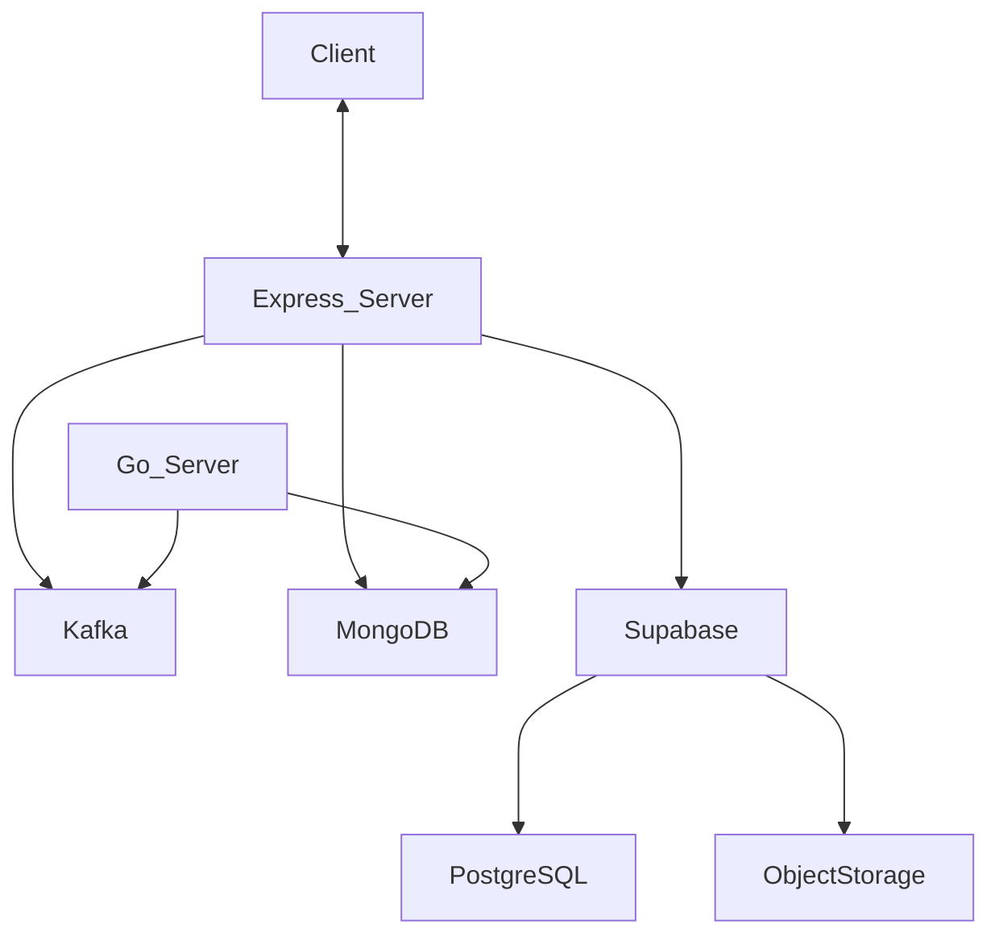
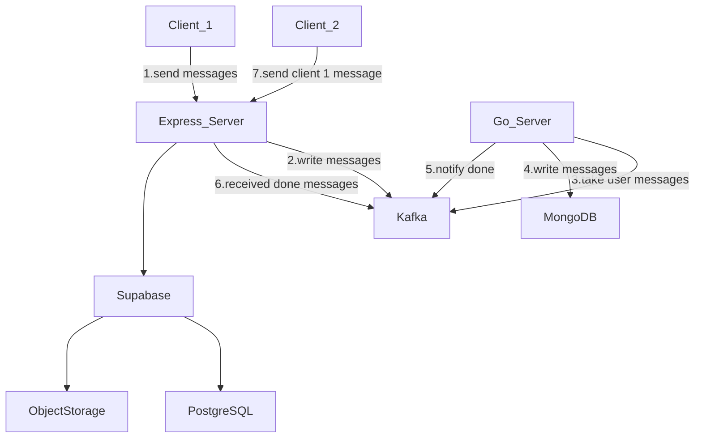

# Chitter
A realtime chat app, with customizeable themes, emojis and parallax backgrounds for chat room.
Frontend: https://github.com/khuongduy354/chitter-fe

# Overall Structure

# Flow 

### Join room 
```mermaid 
flowchart TD
```

### Send Realtime messages 



### Themes upload

``` mermaid
flowchart TD
``` 

### Other CRUD operations 


# Features  
- Google OAuth Authentication
- 1-1 realtime chat
- Groups: create groups, realtime group chat
- Add Friends 
- Upload custom emojis and use for chat messages
- Parallax Background editor and apply these backgrounds for chat panel 
- Save themes configs: message colors, backgrounds used,...

# Why   
- Messager app default themes aren't enough for me, I want themes (backgrounds, msg colors,...) to be created by users. 
- Message Panel receives lots of scrolling by users, and I notice Parallax Background also works best by scrolling, so I combine the two.

# Quick Start 
```
git clone https://github.com/khuongduy354/chitter.git 
cd chitter
npm install  
npm run dev
``` 

# Run with Docker 
1. create a docker.env file inside ./Docker folder
2. Run commands in order
```python  

# 1. BUILD 
# UNIX
make build_all

# others
docker build -f Dockerbuild/Dockerfile-gopgms -t chitter/go-ms:1.0 . 
docker build -f Dockerbuild/Dockerfile-express -t chitter/express-server:1.0 .  

# 2. RUN  
make run-docker-compose
``` 
3. go-ms should print Received message & Written to MongoDB after done 
Setup example: https://github.com/segmentio/kafka-go/tree/main/examples

# Supabase  

```
cd supabase 
# check Makefile for available commands
```

# Tunnel with ngrok   
<TODO: add this to docker above>  

1. run with docker above
2. install ngrok & add token : https://dashboard.ngrok.com/get-started/setup/
3. ngrok http http://localhost:8000

# Tech Stack  
- Typescript 
- Express.js  
- Socket.io
- Supabase PostgreSQL
- Golang
- Kafka
- MongoDB 
- Multer
- Docker 
